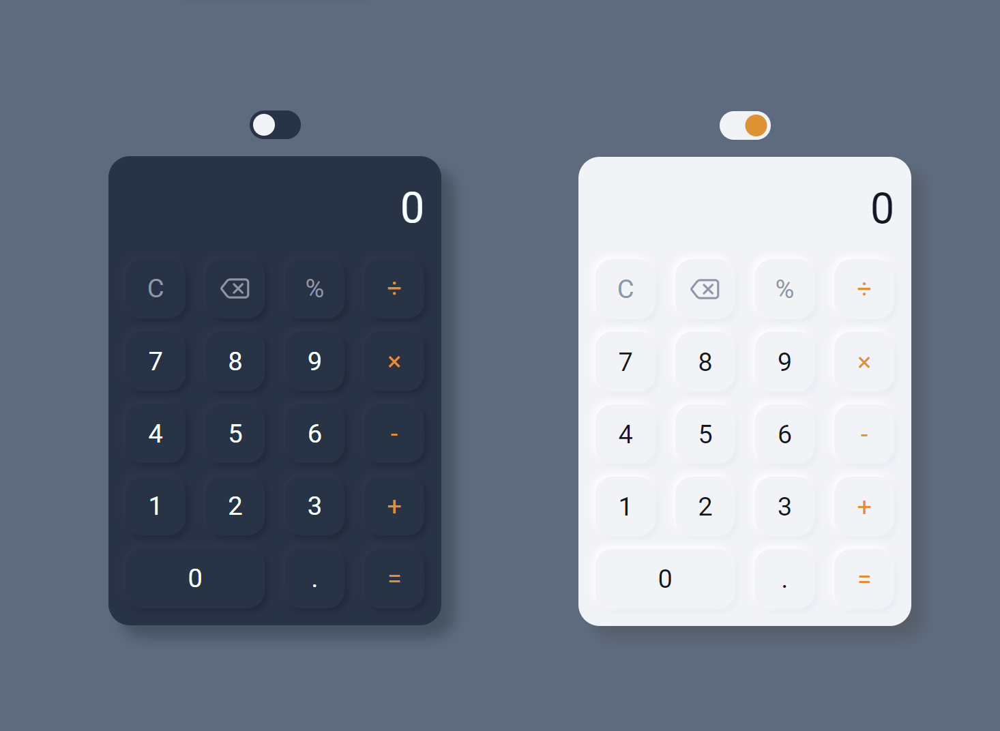

# Calculator 

[Ссылка на деплой](https://lagertt.github.io/Calculator/)

Данный проект - это калькулятор на подобие приложения на iphone, в нём не много функциональности, т.к. это в принципе первая проба js))

Дизайн в стиле неоморфизма нашла на pinterest. Сам код написан на чистом js, html c методологией БЭМ. 

